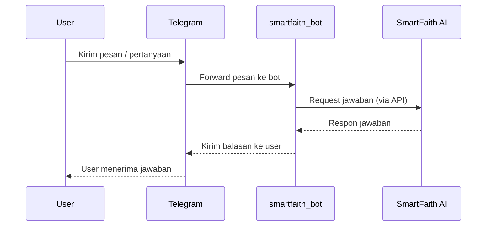

# 🤖 smartfaith_bot

[](https://t.me/smartfaith_bot)
[](https://smartfaith.streamlit.app/)
[](#)
[](LICENSE)
[](https://github.com/mrbrightsides/smartfaith-bot/pulls)

Telegram bot untuk **SmartFaith**, platform AI Islami berbasis chatbot.  
Bot ini memungkinkan interaksi cepat via Telegram untuk:
- Tanya jawab seputar Islam
- Akses fitur SmartFaith langsung dari chat
- Integrasi keep-alive menggunakan NSSM agar bot tetap online

---

## ✨ Fitur Utama

- 💬 **AI Chatbot**: Tanya jawab interaktif dengan dukungan bahasa alami.  
- 🔗 **Integrasi Telegram**: Mudah digunakan lewat @smartfaith_bot.  
- 🧾 **Logging & Monitoring**: Catatan interaksi untuk debugging.
- 🧪 **Command dasar**: start/help, tanya/quote (contoh).    

---

## 📦 Instalasi & Setup

Clone repo:
```bash
git clone https://github.com/mrbrightsides/smartfaith-bot.git
cd smartfaith-bot
```
Install dependensi:
```bash
pip install -r requirements.txt
```
Buat file .env untuk menyimpan token:
```bash
TELEGRAM_TOKEN=your_telegram_bot_token
OPENAI_API_KEY=your_openai_api_key
```
Jalankan bot:
```bash
python bot.py
```

---

## 📂 Struktur Proyek

```bash
.
├── bot.py            # Core logic bot Telegram
├── keep_alive.py     # Server Flask untuk ping/keep-alive
├── requirements.txt  # Dependensi Python
├── LICENSE
└── README.md
```

---

## 🧭 Alur Bot



---

## 🚀 Deployment

- Replit: langsung jalankan bot.py + aktifkan keep_alive.py.

- VPS/Server pribadi: gunakan pm2 atau systemd untuk menjaga proses tetap hidup.

- Docker (opsional):
```bash
docker build -t smartfaith-bot .
docker run -d --env-file .env smartfaith-bot
```

---

## 📌 Roadmap

- Integrasi database (logging percakapan permanen)

- Dukungan multi-bahasa

- Mode grup (AI bisa join grup Telegram)

- Integrasi langsung dengan API SmartFaith App

---

## 📜 Lisensi

MIT © 2025 SmartFaith / ELPEEF

  `💡 Bot ini bagian dari ekosistem SmartFaith: aplikasi AI Islami untuk edukasi, dakwah, dan inspirasi.`
